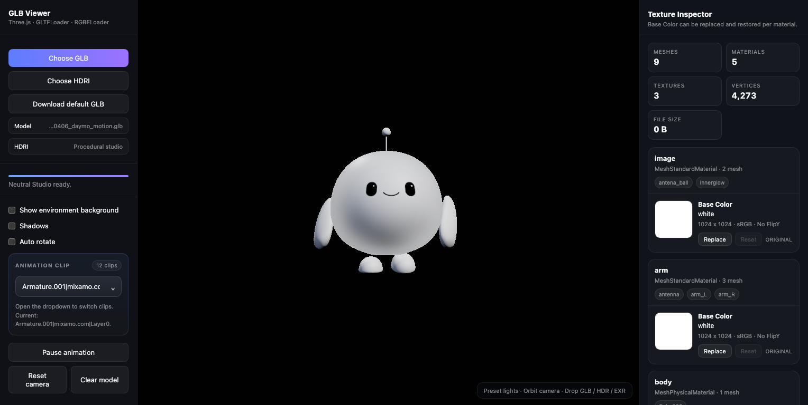

# character-workbench

Single-character browser workbench built with Three.js.



## Links

- Repository: `https://github.com/fluenttsol/glb-viewer`
- Live: `https://glb-viewer-ebon.vercel.app`

## Run

```bash
python3 -m http.server 8123
```

Open `http://127.0.0.1:8123/`.

## Workflow

- Canonical character asset: `assets/260408_daymo_motion.glb`
- Reload the latest character build from the fixed asset path
- Review animation clips and playback
- Inspect replaceable textures and face sprite sheets
- Optionally swap HDRI for look-dev checks
